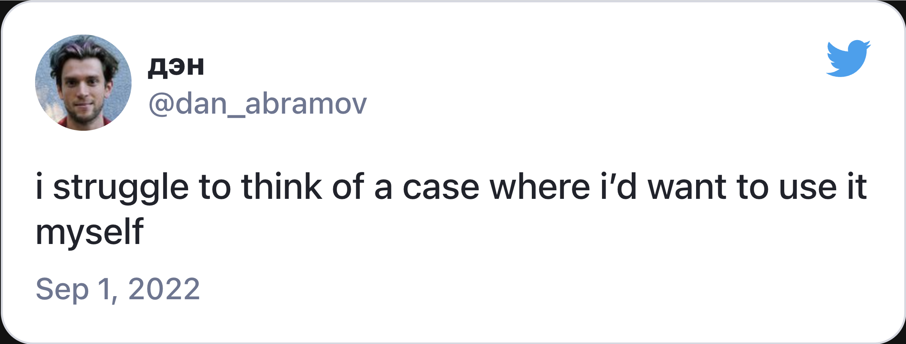
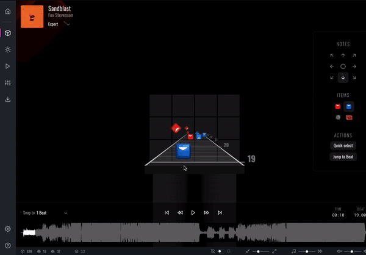

# Verktøy for tilstand

<v-click hide>

{width=500px lazy}

</v-click>

<v-after>

{width=500px lazy}

</v-after>

<!--

Siden Redux har vært så populært, vil jeg trekke det frem. Men du skal sjeldent trenge Redux, med all dens kompleksitet. Selv Dan Abramov, som var en av skaperne av Redux, sier han sliter med å finne usecases for det.

[click] Så kommer Josh Comeau og lager dette sjuke redigeringsprogrammet for beat-saber, med nettopp Redux. 

Comeaus poeng er at Redux kan passe bra på klient-tunge applikasjoner. Men det fins få applikasjoner som er så klient-tunge som dette. Typisk er det redigeringsprogram som dette.

-->

---
transition: fade
---

# Verktøy for tilstand

|     | Klient          | Server            |
| --- | --------------- | ----------------- |
| Lokal |   |  |
| Global |  |  |

<!--

Så avslutningsvis, når dere nå kommer tilbake til deres kode, hvordan velger dere blant disse verktøyene? 

Valget avhenger av typen tilstand du har med å gjøre. Om den er synkron eller asynkron, og om du trenger å ha den global eller det holder med lokal. 

Så vil akkurat hvilket verktøy du velger innenfor gruppen, avhenge av noe så kjedelig som din kontekst og preferanse. 

-->

---
transition: fade
---

# Takk for meg!

<!-- 

Det var alt dere trengte å vite om server- og klient-tilstand. Tusen takk for meg!

-->